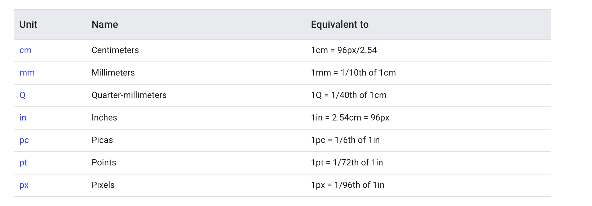
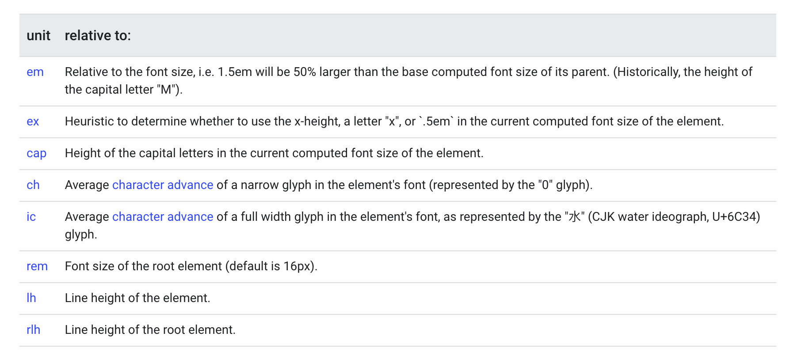
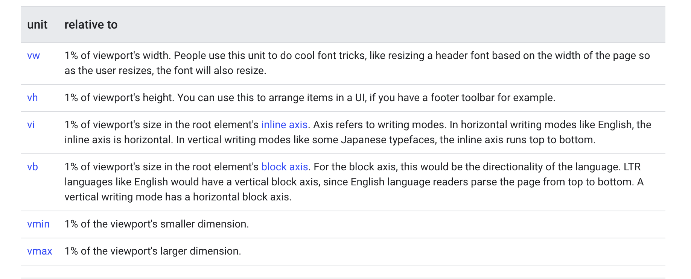

# Class notes - 28th October 2023 - Fundamentals of CSS

- Anatomy of Style Rule
  

  NB - shorthand properties
- [Media Queries](https://codepen.io/setemiojo/pen/BaMjYzW)
- Selectors
  - Simple Selectors (universal, type, class, id, attribute-`[attribute_name='value' s], [href*='example.com'] contains, [href^='https'] start with, [href$='.com'] ends with`, grouping with comma)
  - Pseudo Class(states) `:hover, :nth-child(), :checked`  and Elements `::before, ::after, ::marker, ::selection`
  - Complex Selectors (combinator - descendants (space) next siblings (+) subsequent siblings (~)), and compound (combining multiple css rules p.class, p#id)
- [Color](https://www.joshwcomeau.com/css/color-formats/)
  - Hex code
  - Hex code with Alpha
  - RGB
  - RGBA
  - HSL
  - HSLA
  - [Color keywords(148)](https://developer.mozilla.org/docs/Web/CSS/color_value#color_keywords),
- Units
  - EMs (font-size of the current element)
  - REMs (relative to the root element)
  - Percentages
  - Dimension and lengths
  - Angle deg, rad, grad, turn (1 turn = 360deg)
  - Resolution units dpi (dots per inch)





- Typography
  - Font families (Serif, San-serif, Mono)
  - Web fonts

```html
<link rel="preconnect" href="https://fonts.gstatic.com">
<link href="https://fonts.googleapis.com/css2?family=Roboto:wght@400;700&display=swap" rel="stylesheet">
```

```css
* {
  font-family: 'Roboto', Arial, sans-serif;
}
```

Common text formatting are Bold `font-weight`, Italic `font-style`, and Underline `text-decoration`.

Alignment `text-align` and the rrecent language directions.

Text transforms to change the case of text

Spacing letter-spacing and line-height

- Debugging in the Browser

## Important Links

- [Selector Game](https://flukeout.github.io)
- [Selector explained](https://kittygiraudel.github.io/selectors-explained/)
- MDN references for [selectors](https://developer.mozilla.org/docs/Web/CSS/CSS_Selectors), [Pseudo classes and Pseudo elements](https://developer.mozilla.org/docs/Learn/CSS/Building_blocks/Selectors/Pseudo-classes_and_pseudo-elements)
- [Sizing and Units](https://developer.mozilla.org/docs/Learn/CSS/Building_blocks/Values_and_units)
- [Variable Fonts](https://web.dev/articles/variable-fonts)
