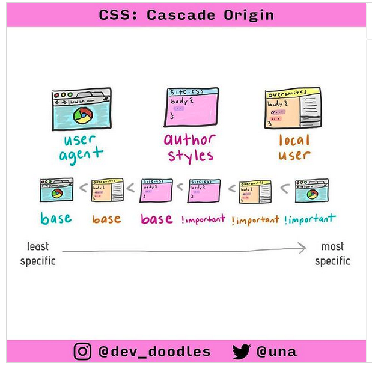
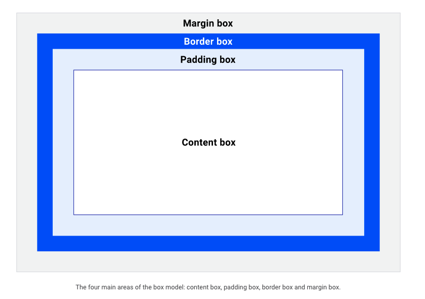
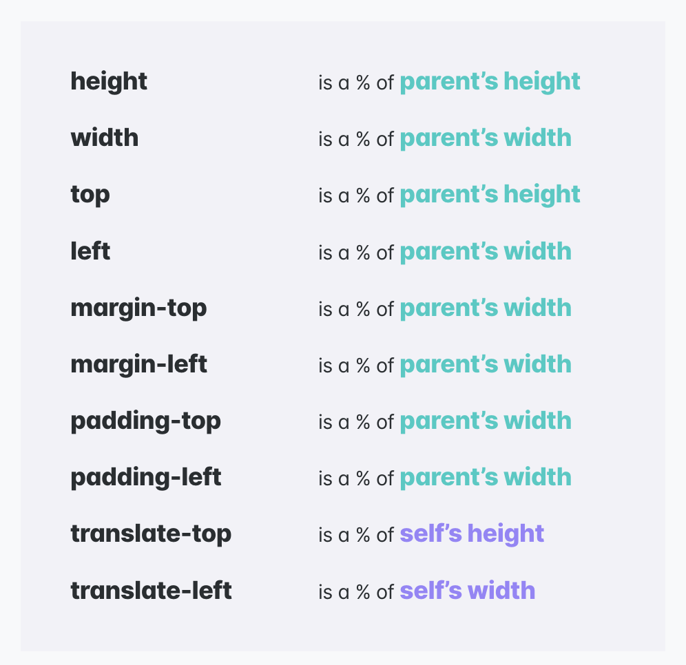
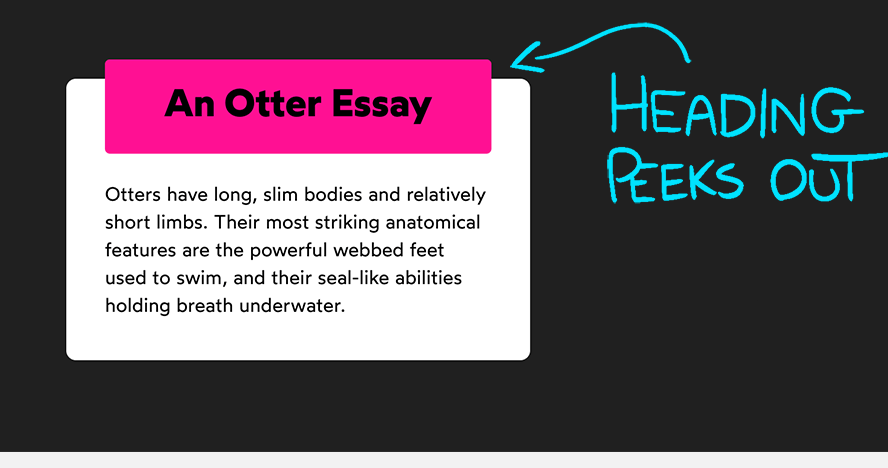
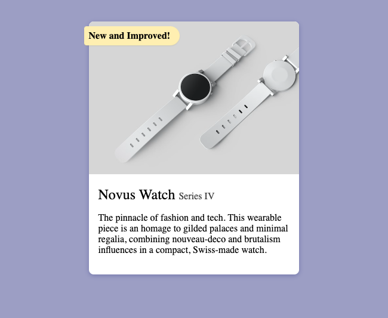
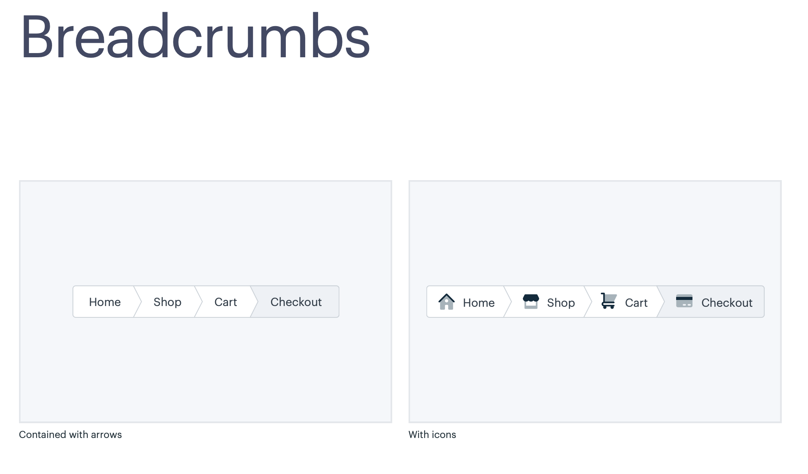
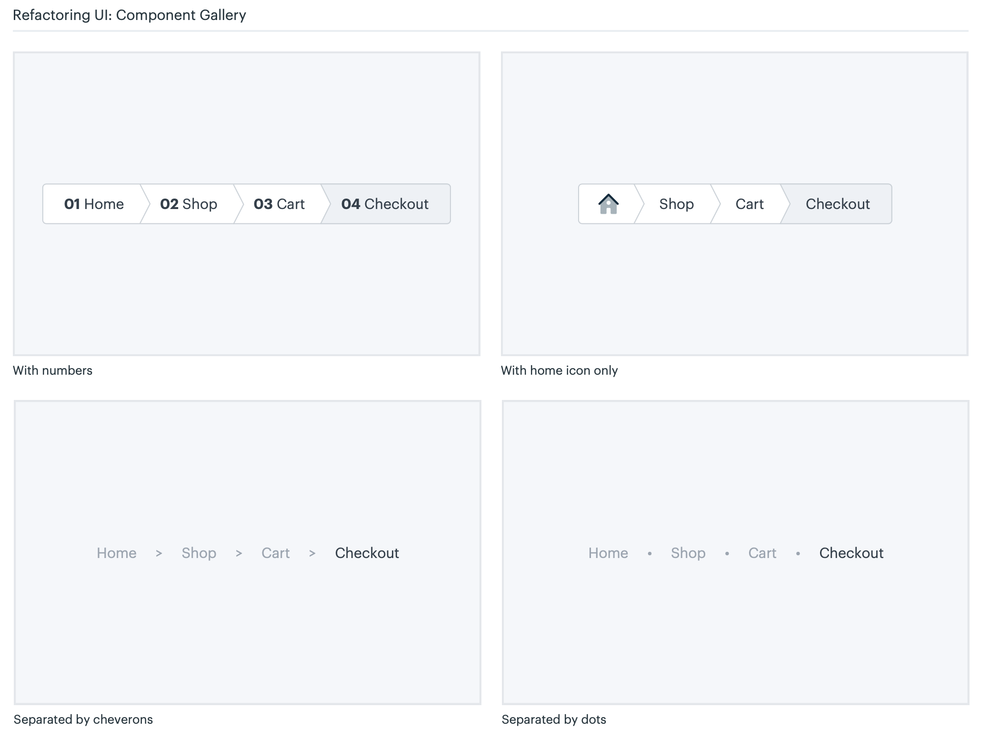
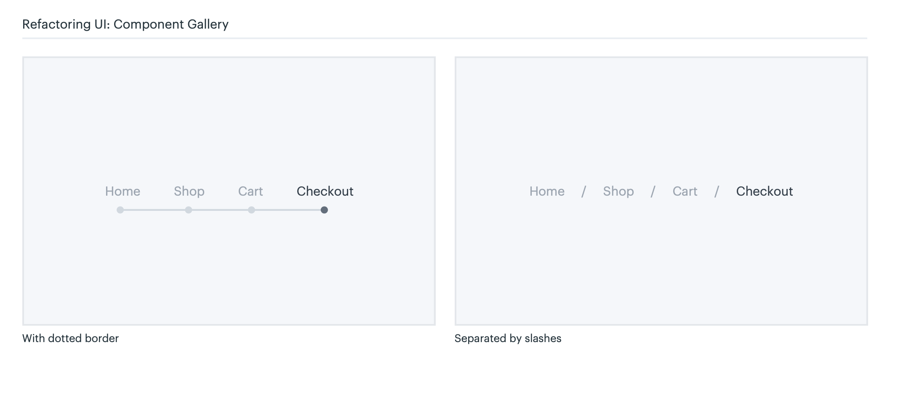

# Class notes - 4th, 8th November 2023 - Rendering Logic

- Builtin Declaration and Inheritance (initial, inherit, unset)
- Cascading
  
- [Block(vertical) and inline(horizontal) directions](https://developer.mozilla.org/en-US/docs/Web/CSS/CSS_Logical_Properties)

```css
p {
  display: block;
  margin-block-start: 1em;
  margin-block-end: 1em;
  margin-inline-start: 0px;
  margin-inline-end: 0px;

  margin-top: 1em;
  margin-bottom: 1em;
  margin-left: 1em;
  margin-right: 1em;
}
```

> The main selling point for logical properties is internationalization. If you want your product to be available in a left-to-right language like English and a right-to-left language like Arabic, you can save yourself a lot of trouble by using logical properties.

- Box Model
  
  1. Content box
  2. Box-sizing
  3. Padding
  4. Border
  5. Margin (negative margin, auto margins( only works for horizontal margins, on element with explicit width ))





- Flow Layout
  - width **algorithms**
  - height algorithms
  - Margin collapse

[Building something Amazing](https://codepen.io/setemiojo/pen/JjxNJVm)

- Relative Positioning
- Absolute Positioning
  - Centring Trick

- Stacking Context and containing blocks
- Fixed Positioning
- Overflow
  - Scroll containers
  - Horizontal Overflow
  - Positioned Layout
- Sticky Positioning
- Hidden Content

## Important Links

- [Cascade](https://2019.wattenberger.com/blog/css-cascade)
- [Josh W Comeau CSS Reset](https://www.joshwcomeau.com/css/custom-css-reset/)
- [Understanding % calculation](https://2019.wattenberger.com/blog/css-percents)
- [Revert vs Unset](https://developer.mozilla.org/en-US/docs/Web/CSS/revert)
- [Nesting in CSS](https://caniuse.com/?search=nesting)

<!-- basic -->
element and pseudo-element 001
class and pseudo-class 010
id 100
inline 1000
!important 10000

<!-- w= border + padding + content (border-box) -->
<!-- w= content (content-box) -->

<!-- workshop -->
](image-8.png)

[Click here to access the Huckleberry Figma](https://www.figma.com/file/6hGqKA5scrZJScb9KW3Hj2/Huckleberry?type=design&node-id=0-1&mode=design&t=tu3A2tnzktp0rSVN-0)
<!-- classwork -->




