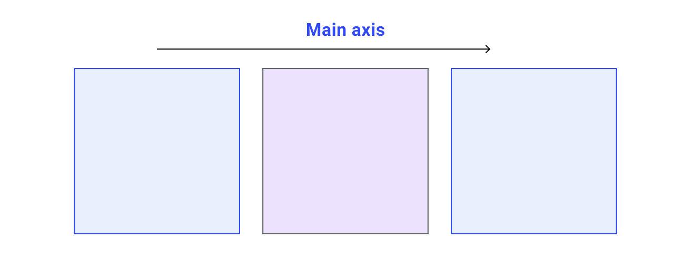
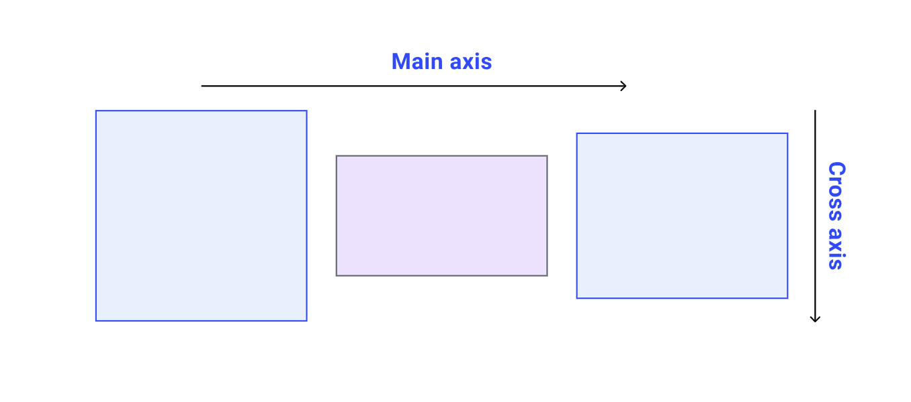
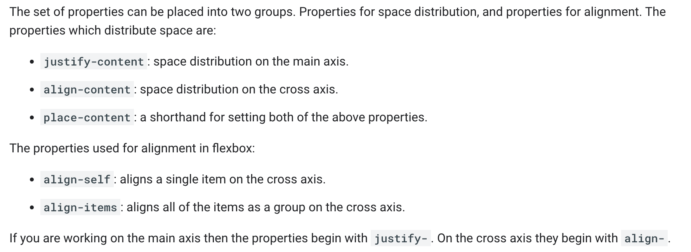
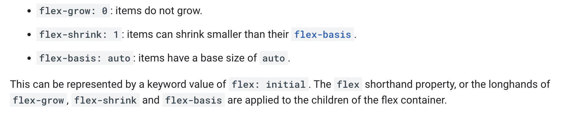
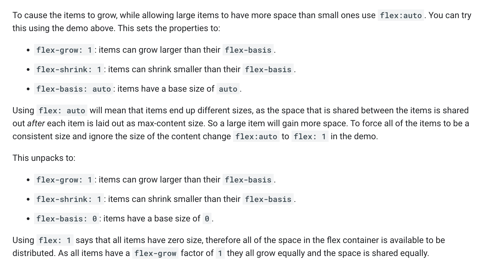
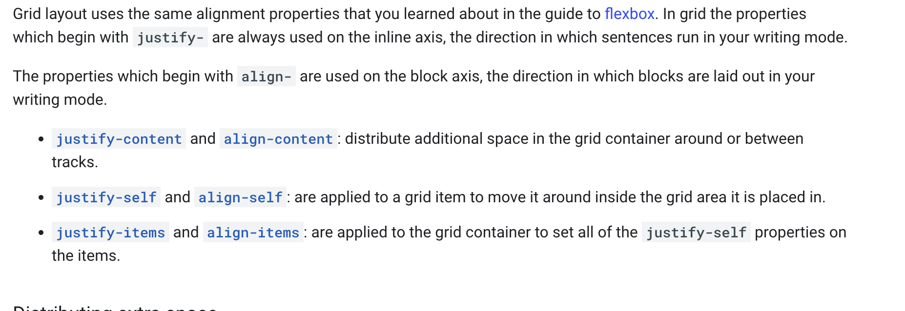

# Class notes - 8th November 2023 - Modern UI and Flex Box

- Build Different UI concepts
- Flex


  - [Directions](https://codepen.io/web-dot-dev/pen/bGgKNXq) and Alignments([Justify-content](https://codepen.io/web-dot-dev/pen/JjERpGb),[Justify-coontent-column](https://codepen.io/setemiojo/pen/bGzKKam), [align-content](https://codepen.io/web-dot-dev/pen/poREawo), [align-self](https://codepen.io/web-dot-dev/pen/RwKGQee) )

  - [Growing and shrinking (flex shorthand, constraints and gotchas)](https://codepen.io/web-dot-dev/pen/LYxRebE)
  - [Wrapping](https://codepen.io/web-dot-dev/pen/WNRGdNZ)
  - Groups and Gaps
  - [Ordering](https://codepen.io/web-dot-dev/pen/NWdRXoL)


[Play with the default values](https://codepen.io/web-dot-dev/pen/LYxRebE)
[Flex works well with auto margins](https://codepen.io/web-dot-dev/pen/poRELbR)

- Grid
  - Terminology(Line, tracks, cell, area, gaps, container, item)

  - Rows and columns (intrinsic sizing, [fr unit(similar to flex: auto)](https://codepen.io/web-dot-dev/pen/vYgyXNE), minmax(), repeat, [auto-fill](https://codepen.io/web-dot-dev/pen/MWJbbNe), auto-fit)
[Repeating fixed size tracks](https://codepen.io/web-dot-dev/pen/XWpNjgO)
[Auto responsive grid](https://codepen.io/web-dot-dev/pen/OJWbRax)
  - Alignment

  - [Grid Areas](https://codepen.io/web-dot-dev/pen/oNBYepg)

```html
header {
    grid-area: header;
}

.sidebar {
    grid-area: sidebar;
}

.content {
    grid-area: content;
}

footer {
    grid-area: footer;
}
```

```css
header {
    grid-area: header;
}

.sidebar {
    grid-area: sidebar;
}

.content {
    grid-area: content;
}

footer {
    grid-area: footer;
}
```

- Tracks and Lines(support negative line number 1/-1)

- Fluid Grids
- Subgrids
- Dividers

## Important Links

- [Flex.io bg wesbos](https://flex.io) and Youtube playlist
- [Grid.io bg wesbos](https://flex.io) and Youtube playlist
- [CSS Trick Guide to Flexbox](https://css-tricks.com/snippets/css/a-guide-to-flexbox/)
- [CSS Trick guide to grid](https://css-tricks.com/snippets/css/complete-guide-grid/)
- [Centering with Flex and Grid](https://codepen.io/setemiojo/pen/QWYBPYq)
- [Centering in CSS CSS Tricks](https://css-tricks.com/centering-css-complete-guide/)
- [Interesting one line css tricks by una kravets](https://1linelayouts.glitch.me/)
